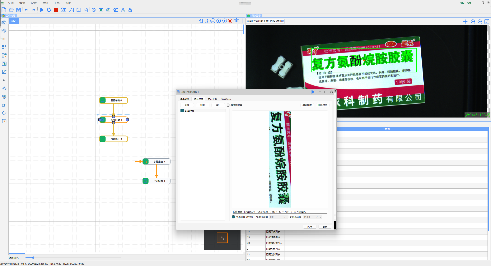
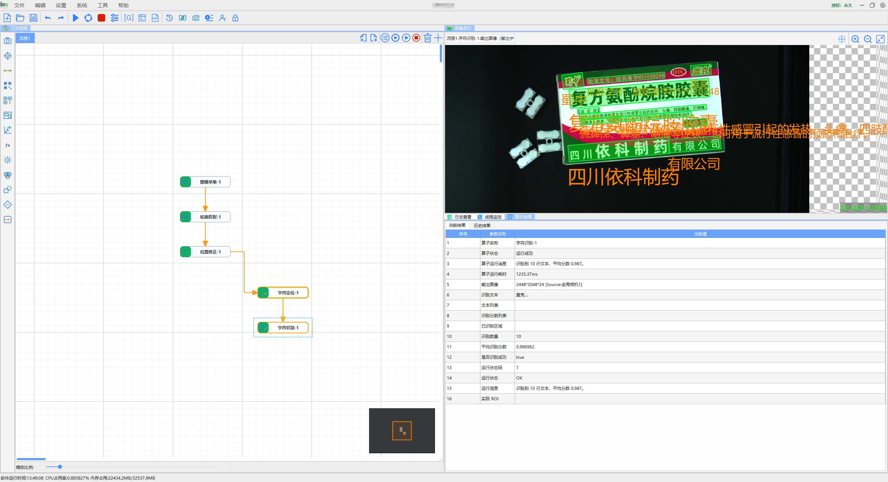
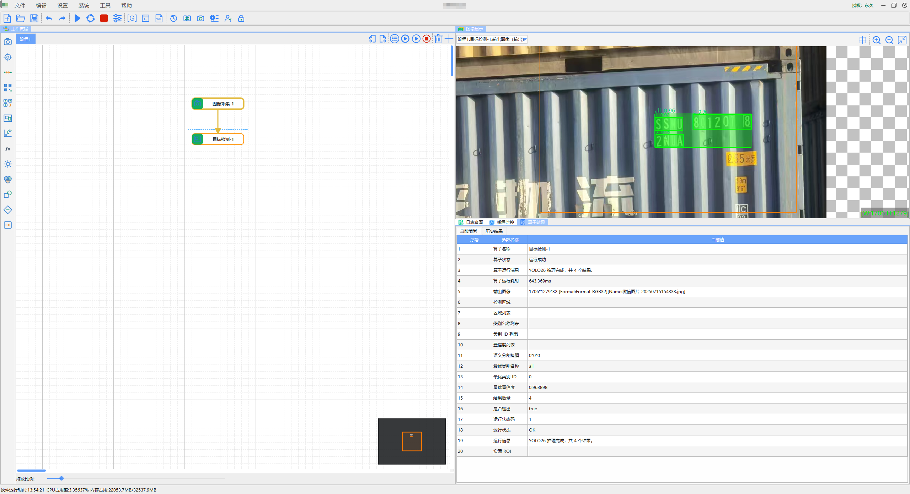
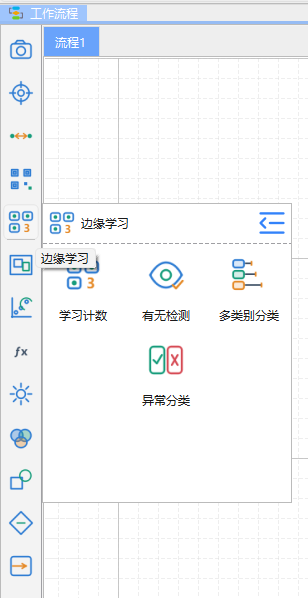
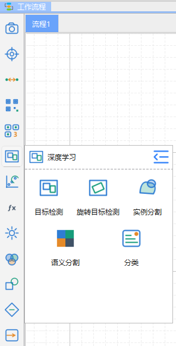
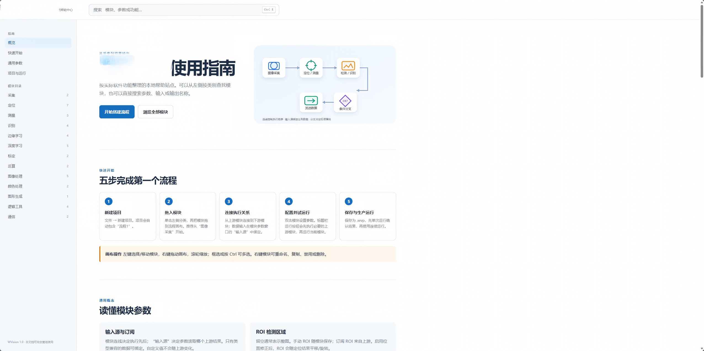

# VisionMaster

> 面向工业视觉应用的可视化流程编排平台，基于c++和QT6复刻海康visionmaster，支持跨平台（国产麒麟系统、linux系统）
> C++ / Qt 6 / OpenCV / OpenVINO / ONNX / PaddleOCR

VisionMaster 是一个面向工业检测、识别、定位与自动化集成场景的机器视觉平台。通过可视化流程编排，将图像采集、定位、测量、OCR、目标检测、边缘学习、深度学习推理、结果判定与通信输出串联为可维护的检测流程。

平台强调工程化落地：既支持传统视觉算法，也支持 AI 推理与少样本学习能力，适合设备集成、产线检测、视觉方案验证及二次开发场景。

## 核心能力

- **可视化流程编排**：拖拽式搭建检测流程，支持模块连接、参数配置、运行结果查看与流程管理。
- **定位与匹配**：轮廓匹配、软阈值、Blob 分析、圆查找、椭圆查找、直线查找、位置修正等。
- **字符识别**：文本定位、字符识别、识别区域与结果输出。
- **深度学习视觉**：目标检测、旋转目标检测、实例分割、语义分割、分类等能力。
- **边缘学习**：学习计数、有无检测、多类别分类、异常分类，适合小样本快速部署。
- **标定与测量**：像素尺寸标定、坐标转换、几何测量与结果验证。
- **工业集成**：图像采集、串口 / TCP / UDP 通信、变量运算、条件分支、子流程与结果输出。
- **离线帮助中心**：内置模块用途、参数说明、推荐流程和使用提示，可脱离网络查看。
- **跨平台架构**：基于 Qt 6 与 CMake 构建，已经可以成功在 Windows、Linux 及国产化系统跨平台部署，后续计划拓展智能相机的嵌入式平台。

## 功能展示

### 2.5D定位引导

### 字符缺陷检测

### 轮廓匹配与位置修正

### 字符定位与 OCR 识别

### 深度学习目标检测

### 定位功能模块

### 边缘学习功能模块

### 深度学习功能模块

### 内置离线帮助中心

## 技术方向：Vision Agent

当前正在探索将多模态大模型引入机器视觉平台，目标是让视觉方案搭建从“人工配置模块”演进为“自然语言驱动的流程生成”。

设想包括：

- 根据检测需求自动推荐并搭建视觉流程；
- 根据图像内容和业务目标自动生成模块参数建议；
- 自动完成 ROI 设计、模板创建、匹配策略选择与结果校验；
- 结合现场运行结果持续辅助调参与问题定位。

如果你对工业视觉、边缘学习、视觉大模型、自动化流程生成或设备集成感兴趣，欢迎交流。

微信&电话：`17862923747`

## 声明

本项目为独立技术实现与工程实践展示，不包含任何第三方商业软件的源代码、资源或受保护内容。公开前请确认截图、模型、项目文件及现场数据均已获得展示授权。
